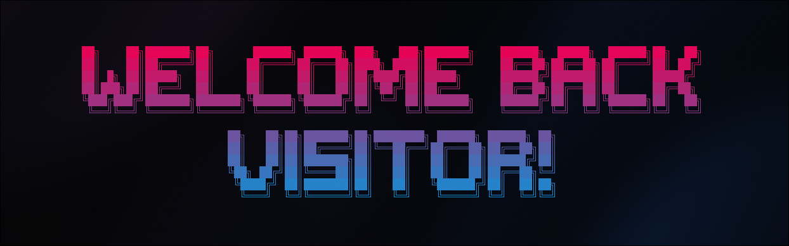

<h1> </h1>
<h3 align="center">A customizable, user-defined message aligner for terminal interfaces, built entirely around standard output</h3>

<p align="center">The Aligner is a software tool designed to transform boring, raw terminal interfaces into incredible and elegant message displays. It's fully customizable with colors, display modes, messages, and remote control. Everything you need to make your setup look awesome!</p>

<br/>

## Table of contents
[What Aligner is](#what-aligner-is-)

[What Aligner is not](#what-aligner-is-not-)

[Works seamlessly on](#works-seamlessly-on-%EF%B8%8F)

[Encoding configuration](#encoding-configuration-)

[Building the software](#building-the-software-%EF%B8%8F)

[Base functionalities](#base-functionalities-)

[Render modes](#render-modes-%EF%B8%8F)

[Message colors](#message-colors-%EF%B8%8F)

[Gradient angle](#gradient-angle-)

[Application modes](#application-modes-)

[Control server](#control-server-%EF%B8%8F)

## What Aligner is ✅
<ul>
	<li>An application that runs on modern terminals.</li>
	<li>A program that fully operates on standard output.</li>
	<li>Single-threaded software.</li>
	<li>A program that displays UTF-8 messages in the terminal.</li>
</ul>

## What Aligner is not ❌
<ul>
	<li>A program that displays images on the terminal.</li>
	<li>A program that displays the exact same color palette across different terminals.</li>
</ul>


## Works seamlessly on ⚙️
<ul>
	<li>Alacritty</li>
	<li>Kitty</li>
   	<li>Gnome terminal</li>
  	<li>Konsole</li>
	<li>XFCE Terminal</li>
	<li>TTY</li>
</ul>

## Encoding configuration 🈶
This program uses UTF-8 encoding to display Unicode messages. To ensure it functions properly, you must have the `en_US.utf8` encoding available on your system. You can verify the existence of this encoding by running the command `locale -a`. If it is not installed, you can generate it by executing the following command:
```sh
sudo locale-gen en_US.UTF-8
```

## Building the software 🛠️
The Aligner is a Rust-based application, so its dependencies and compilation are fully managed by Cargo.

### Compiling
This program is compiled using the following command. Run it from the project root directory:
```sh
cargo build --release
```
After that, the executable file `aligner` will be generated in the `target/release` directory.

## Base functionalities 🪛
Aligner's primary trait is its ability to align messages, so to make the program work, you must provide it with a message file containing UTF-8 content or a string fully made of ASCII characters. 

### Using a message file
```sh
./aligner --file message.txt

# or

./aligner --file /home/user/.messages/message.txt
```
Note: Press any key to exit the program

### Using a simple ASCII string
```sh
./aligner --text "Hello, World!"
```
Note: This message display uses a built-in font scheme that supports the characters a-z, A-Z, 0-9, and a few punctuation marks.

### Aligning the message
The Aligner provides two ways to align messages: horizontally and vertically. These can be triggered using the `--vertically` and `--horizontally` optional flags. So to make the message be diplayed in the middle of screen, this program call should do the trick:
```sh
./aligner --text "Hello" --vertically --horizontally
```

## Render modes 🎞️ 
This project implements three different render modes, which define how the Aligner behaves when displaying a message on screen.

### Flash mode (Default)
Flash mode displays the given message instantly, with no animation or special behavior.

### Line-by-line mode
In line-by-line mode, a delay in milliseconds is provided as an argument, and each line of the message is displayed after the delay has elapsed. The rendering is done from top to bottom.

Line-by-line mode is enabled with the `--line-line x` flag, where `x` specifies the delay in milliseconds.

### Char-by-char mode
Char-by-char mode also takes a delay in milliseconds as an argument, and each grapheme of the message is displayed after the delay has elapsed. The rendering is done from top to bottom, left to right.

Char-by-char mode is enabled with the `--char-char x` flag, where `x`specifies the delay in milliseconds.

## Message colors 🖍️
By default, the Aligner prints your message in white. However, it also allows you to specify a different color, or even a gradient. To do so, use the `--colors [colors]` flag, where `[colors]` is a list of hexadecimal color codes, each color enclosed by quotes.

If only one color is provided, your message will be displayed in that solid color. If two or more colors are given, a gradient will be applied using the specified colors.

Example:
```sh
./aligner --text "Hello, World!"  --colors "#FF0000" "#0000FF"
```

## Gradient angle 📐
If two or more colors are provided, you can specify the angle of the generated gradient in degrees. To do so, use the `--angle x` flag, where `x` is a value between 0 and 360.

Any value greater than 360 will be normalized to the 0–360 range.

## Application modes 🧩
The Aligner comes with two modes that help fine-tune the software to your needs. Both are enabled by default, but you can disable them using simple flags.

### Iterative mode 
In iterative mode, the program does not close after printing the message. Instead, it remains in a loop, waiting for a key press. This allows you to interact with the application without needing to relaunch it every time.

In this mode, you can change the gradient angle by pressing the `,` key (to rotate left) or the `.` key (to rotate right). If you provided two or more colors, you'll see the angle change in real time while holding either of these keys.

If any key other than those used to rotate the gradient is pressed, the application will close immediately.

If you desire to disable this mode, use the `--disable-iterative` flag.

If not disabled, this mode is the first mode that will be loaded by Aligner.

Due to its flexibility, this mode is often used to compose setups and provide a dynamic way of displaying messages.

### Standard output mode
In standard output mode, the program prints the message in the same way as in iterative mode, but instead of waiting for key presses, it exits immediately, allowing you to use your terminal freely.

To disable this mode, use the `--disable-stdout` flag.

If not disabled, this mode is the Aligner's second load option.

Due to its simplicity, this mode is often used to give you a warm welcome message every time you open a new terminal.

## Control server 🖥️
The control server feature was designed to allow external clients to control the Aligner’s behavior. Using this server, you can rotate or set the gradient angle, define a new message, and change the message color, dynamically and remotely.

To enable the control server, use the `--control-server [address:port]` flag. This binds the server to the specified address and port on your system.

This feature handles client communication using JSON messages. To control the aligner, clients must send and receive null-terminated JSONs for proper command execution and error handling.

### Protocol specifications
All communication between the server and client happens over the TCP protocol. On top of this, commands to change the Aligner’s behavior can be sent using the following formats.

<b>Note:</b> All JSON commands must be null-terminated (`\0`).

#### Set gradient angle
```txt
{ "action": "SET_ANGLE", "angle": 180 }
```

#### Define message colors
```txt
{ "action": "SET_COLORS", "colors": "#FFFFFF #F0F0F0" }
```

#### Define message
```txt
{ "action": "SET_MESSAGE", "message": "Hello, world!" }
```
 
#### Rotate the gradient to the left
```txt
{ "action": "ROTATE_LEFT" }
```

#### Rotate the gradient to the right
```txt
{ "action": "ROTATE_RIGHT" }
```

#### Define text
```txt
{ "action": "SET_TEXT", "message": "Hello, world!" }
```

### Pro tips
If you want only programs running on your own machine to control the Aligner’s behavior, bind the server to the `loopback` address (i.e., 127.0.0.1). This will protect the server from any external interference.


